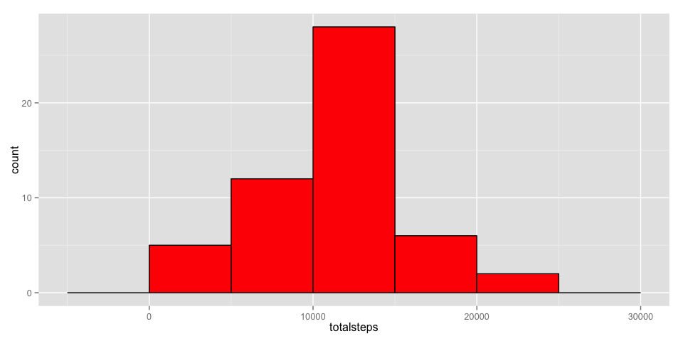
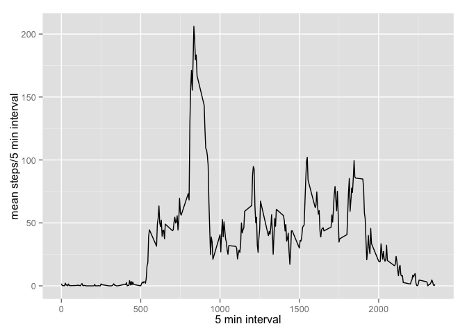
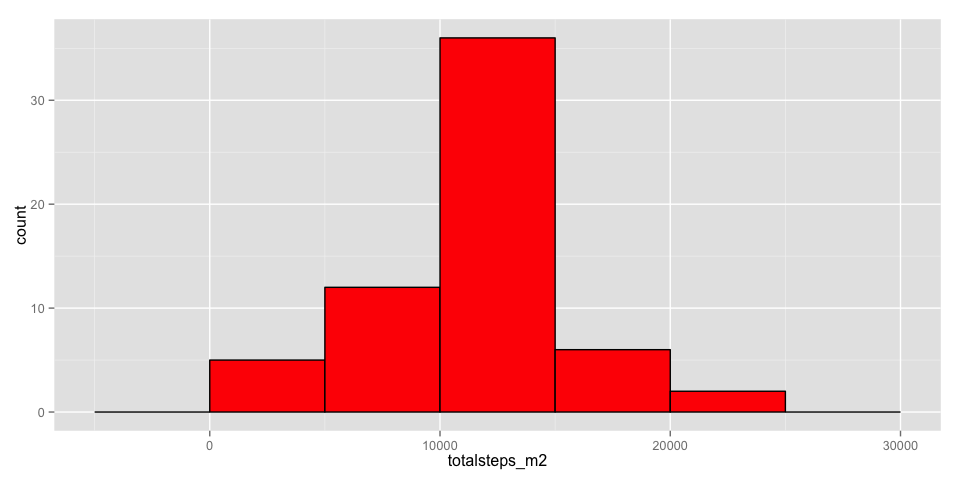
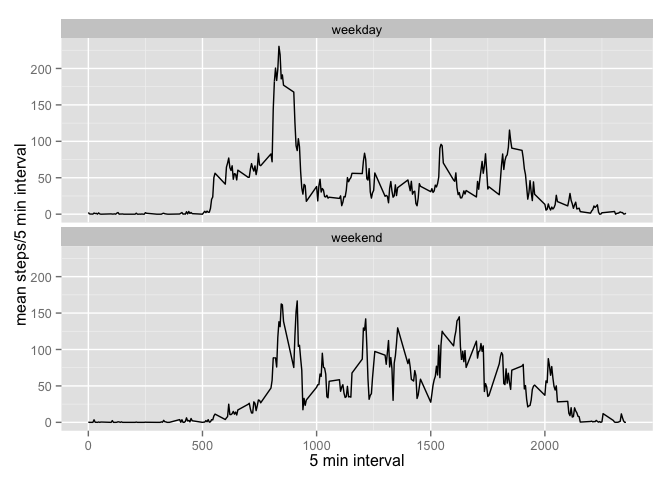

# Reproducible Research: Peer Assessment 1


## Loading and preprocessing the data
Note:  you have to change the https to http and use the mode="wb" option or the download.file will error out due to the file being binary.
### Handling odd behavior with na.rm=TRUE
Normally you can use the dplyr summarise function to sum subsets of a dataframe, and use na.rm=TRUE to exclude NA values in the calculation.  There are certain dates (e.g. 2012-10-01) for which all intervals have steps=NA.  When computing a sum for the intervals on this day, with na.rm=TRUE, R should return NA.  Instead it returns 0.  This is incorrect.  To ensure that NA values do not skew calculations such as mean and median (which are run on the totalsteps/day), the rows with NA values must be removed using is.na function in the preprocessing stage. 

The dataframe no_na will contain the dataset where rows with steps=NA are removed.
The dataframe movement will contain the original dataset with NA values, as read from the .csv.


```r
download.file("http://d396qusza40orc.cloudfront.net/repdata%2Fdata%2Factivity.zip","activity.zip", mode="wb")
unzip("activity.zip")
movement<-read.csv("activity.csv", header=TRUE)
no_na<-movement[!is.na(movement$steps),]
library(dplyr)
```

```
## Warning: package 'dplyr' was built under R version 3.2.2
```

```
## 
## Attaching package: 'dplyr'
## 
## The following objects are masked from 'package:stats':
## 
##     filter, lag
## 
## The following objects are masked from 'package:base':
## 
##     intersect, setdiff, setequal, union
```

```r
library(ggplot2)
```


## What is mean total number of steps taken per day?


```r
bydate<-group_by(no_na, date)
total_bydate<-summarise(bydate, totalsteps=sum(steps))
g<-ggplot(total_bydate, aes(totalsteps))
g<-g+geom_histogram(fill="red", col="black", binwidth=5000)
print(g)
```

 

Below is the mean steps per day.

```r
print(mean(total_bydate$totalsteps))
```

```
## [1] 10766.19
```
Below is the median steps per day.

```r
print(median(total_bydate$totalsteps))
```

```
## [1] 10765
```

## What is the average daily activity pattern?
The following computes the mean number of steps occurring in each 5 minute interval, looking across all days

```r
by5min<-group_by(no_na, interval)
mean_by5min<-summarise(by5min, meansteps=mean(steps))
g<-ggplot(mean_by5min, aes(x=interval, y=meansteps)) + geom_line() + xlab("5 min interval") + ylab("mean steps/5 min interval")
print(g)
```

 

Note: we next find the 5 minute interval at which the maximum number of average steps occurs (looking across all days)

```r
mean_by5min[which.max(mean_by5min$meansteps),"interval"]
```

```
## Source: local data frame [1 x 1]
## 
##   interval
##      (int)
## 1      835
```

## Imputing missing values

The following computes the total number of missing values (NAs):

```r
na_val<-nrow(movement[is.na(movement$steps),])
print(na_val)
```

```
## [1] 2304
```
The total number of NA values in the steps column is 2304

The following code demonstrates a strategy for replacing the NA values in the step column with a reasonable value for number of steps. Recall, we previously computed the mean number of steps for each 5 minute interval, across all days.  The code will substitute this value for any 5 minute interval showing NA. A new dataset called movement2 is created that contains the NA values replaced with the 5 minute interval mean across all days.


```r
movement2<-movement
for (i in 1:nrow(movement2)){
    if (is.na(movement2$steps[i])){
        #replace this 5 minute interval with the average value of this same 5 min interval across all the days
        movement2$steps[i]=round(mean_by5min[mean_by5min$interval==movement2$interval[i], "meansteps"])
    }
}
```

The following computes the mean steps/day and median steps/day, using the new dataset movement2.  This dataset substitutes the avg 5 minute values (across all days) for intervals where there were NA values:

```r
movement2$steps<-as.numeric(movement2$steps)
bydate_m2<-group_by(movement2, date)
total_bydate_m2<-summarise(bydate_m2, totalsteps_m2=round(sum(steps), 3))

g<-ggplot(total_bydate_m2, aes(totalsteps_m2))
g<-g+geom_histogram(fill="red", col="black", binwidth=5000)
print(g)
```

 

Below is the mean steps per day, using a substituted NA value.

```r
print(mean(total_bydate_m2$totalsteps_m2))
```

```
## [1] 10765.64
```
Below is the median steps per day, using a substituted NA value.

```r
print(median(total_bydate_m2$totalsteps_m2))
```

```
## [1] 10762
```
The substituted values increases the number of days the histogram shows in in the range between 10,000 and 15,000.  It also impacted the median value, raising it slightly so median and mean are the same.

## Are there differences in activity patterns between weekdays and weekends?
This is the code that adds a new column of type factor identifying a date as weekend or weekday.  Per the instruction, the dataset that is used is the one where NA values were filled in (the movement2 dataset).


```r
movement3<-movement2 %>% mutate(typeofday=ifelse(grepl('Sat|Sun', weekdays(as.Date(date))), 'weekend', 'weekday'))
movement3$typeofday<-as.factor(movement3$typeofday)
```
The code below will group the rows by typeofday (weekend or weekday), then by interval.  Then a two panel plot will be made, with each panel showing the result for weekend vs weekday.

```r
by5min_typeofday<-group_by(movement3, typeofday, interval)
mean_by5min_typeofday<-summarise(by5min_typeofday, meansteps=round(mean(steps),3))
g<-ggplot(mean_by5min_typeofday, aes(x=interval, y=meansteps)) + geom_line() + xlab("5 min interval") + ylab("mean steps/5 min interval")
g<-g+facet_wrap(~typeofday,ncol=1)
print(g)
```

 

The charts do show a difference in activity levels between weekdays and weekend.  During weekdays there is a sharp spike in activity early in the morning.  This is probably due to this person excercising.  After that, the average activity level during a weekday is lower than that on a weekend.  This person may have a desk job which does not require much activity during the day.  During the weekend, the average level of activity during the day was higher than a weekday.  This is probably due to this person being out and about running errands and doing things outside.
